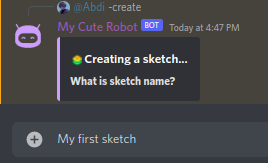

# Quick Start

## Invite me

First, [Invite me to your server](https://discord.com/api/oauth2/authorize?client\_id=972994201195278346\&permissions=8\&scope=applications.commands+bot)

## Your First Sketch

Now it's time to create your first sketch\
But what is a sketch?\
\
A sketch consists of:\
1- Starter\
2- Steps

#### Starter

Sketch's starter is very important because it will decide when this sketch will start. Like when a User joins the server. Or when a User sends a message, for example

#### Steps

Sketch's steps are what describe the sketch behavior, and your cute robot will run them in sequence from 1st step to last step

and the step can be anything, like:

* Send a Message
* React to a Message
* Give a Role to User

Literally anything !

### Now time to create the sketch

1. Go to your server and send
`-create`
2. You will find the bot asking you, what is the Sketch name? Well, anything. Let's write `My first sketch`\
   \`\`
3. Afterward, it will ask you what is the Starter. Let's select when `User Say Something`\
   .png>)\`\`
4. Then we will tell the bot which text to respond to. In this case, let's make it `?hello`\
   .png>)
5. Now the bot will start this Sketch when any User send `?hello` . Time to make our first step\
   .png>)
6. Let's reply to the User with `Heyo <3` . So we will select `Message` . Then inside it we will select `Reply`\
   .png>)
7. But wait, reply to which message? So we will need to tell the bot to reply to the User message that started this sketch\
   .png>)
8. Now send `Heyo <3`\
   .png>)
9. We are done with the first step. Now time for the 2nd step. Nah I'm joking. Let's save the sketch at that\
   .png>)
10. Now time to test the sketch by sending `?hello`\
    .png>)

Congratulations :tada:! you made your first sketch and also your first so-called Auto-Responder
